# Eldergrove Faire

A high-fantasy theme park sim in the spirit of RollerCoaster Tycoon 2, written entirely in
[Bend](https://github.com/bendlang/bend), a massively parallel functional language. Build paths, rides,
shops and your own roller coasters, hire staff, and keep a crowd of wizards, knights, elves and dwarves
happy. Every pixel of art is drawn by code, every sound and note of music is synthesized by code, and
sixteen rules of the park are proven, not just tested, by Bend's checker.

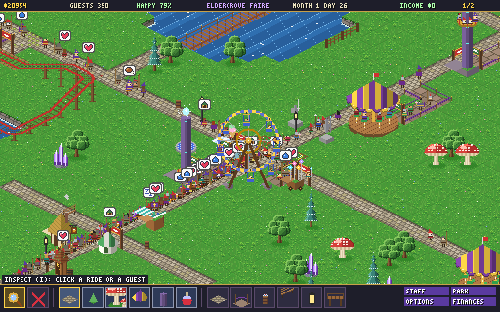

- **Around 15,000 lines of Bend.** Simulation, renderer, UI, synthesizer, save files and proofs, with a
  couple of small C effects for the window and sound.
- **60 fps on the CPU** with 700 guests on screen, and crowds up to 1,200.
- **No image or sound files.** Terrain, rides, guests, the font, the waltz and every sound effect are
  functions.
- **Sixteen machine-checked laws.** Money is conserved, saves round-trip exactly, no seat is given
  twice, and a coaster only opens on a tested, closed circuit, among others.

MIT licensed. See [ROADMAP.md](ROADMAP.md) for how it was built, milestone by milestone, and every
design call along the way.

## Contents

- [Screenshots](#screenshots)
- [What's in it](#whats-in-it)
- [Why Bend](#why-bend)
- [The laws](#the-laws)
- [Build and run](#build-and-run)
- [Controls](#controls)
- [Playing](#playing)
- [For developers](#for-developers)
- [Project layout](#project-layout)
- [License and credits](#license-and-credits)

## Screenshots

| | |
|---|---|
| 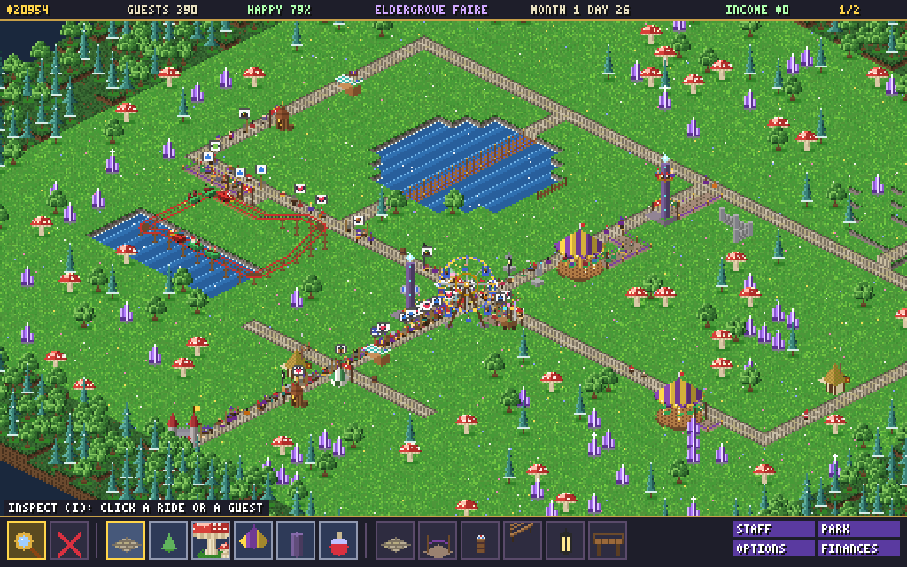 | 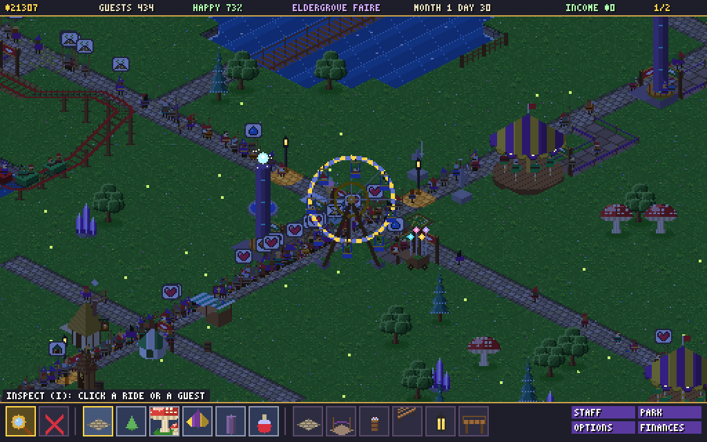 |
| The starter park, zoomed out | Night: lanterns, ride lights and fireflies |
| 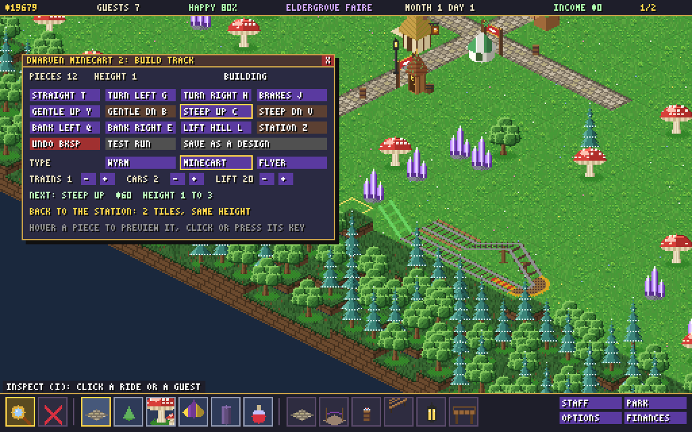 | 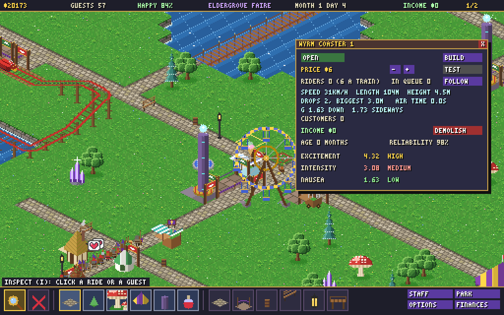 |
| Building a coaster: every piece previews as a green or red ghost | A test run measures the ride and sets its ratings |
| 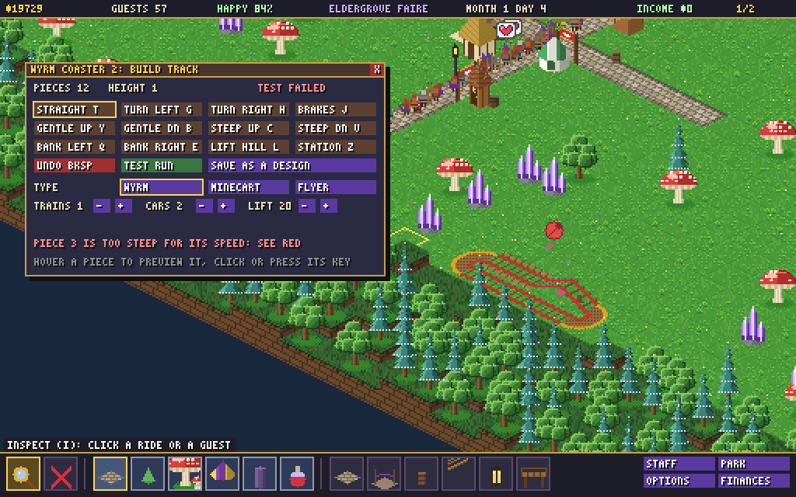 | 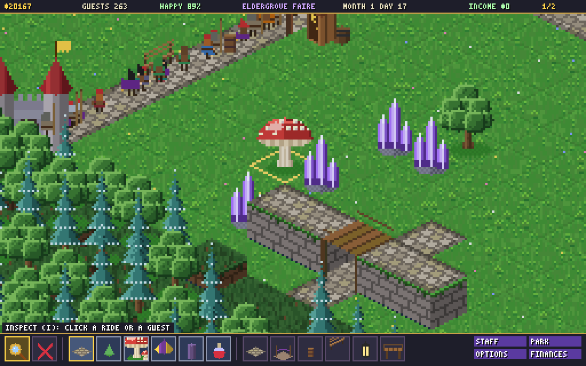 |
| A failed test marks the piece the train couldn't climb | Walkway bridges over paths and track |
| 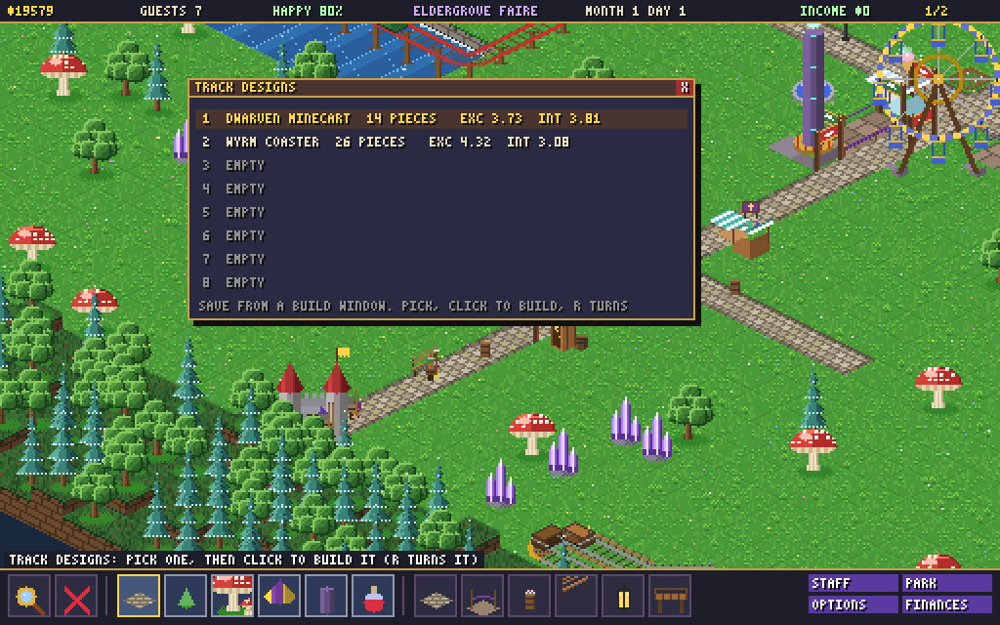 | 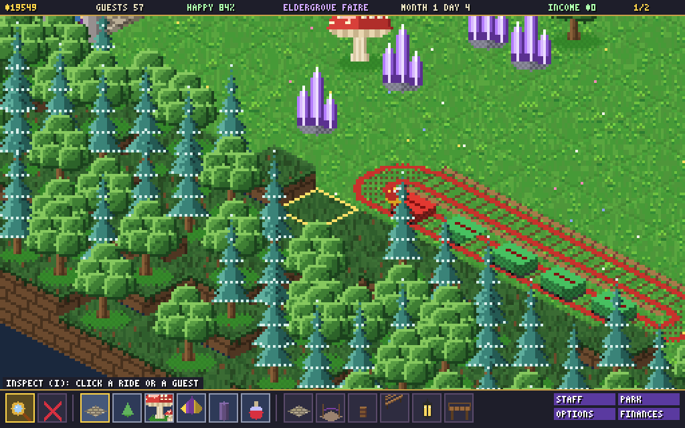 |
| Saved track designs, built anywhere as one ghost | Trains of 1 to 20 cars |
| 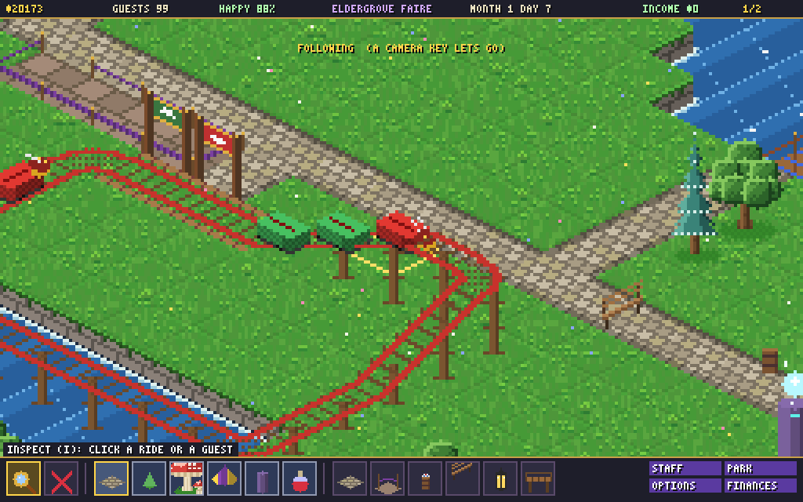 | 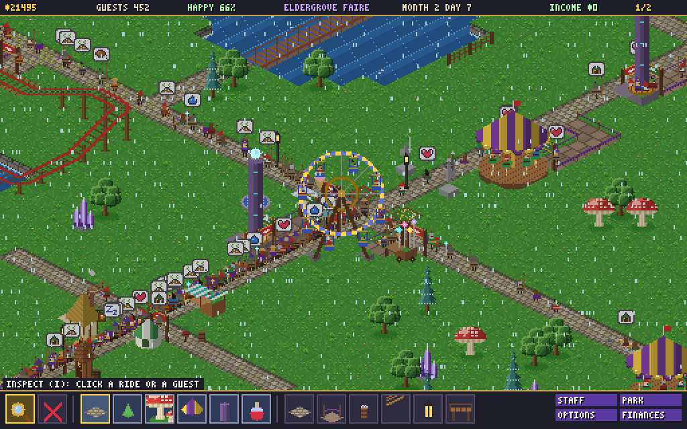 |
| The follow cam | Rain days bring fewer guests |

<p align="center">
  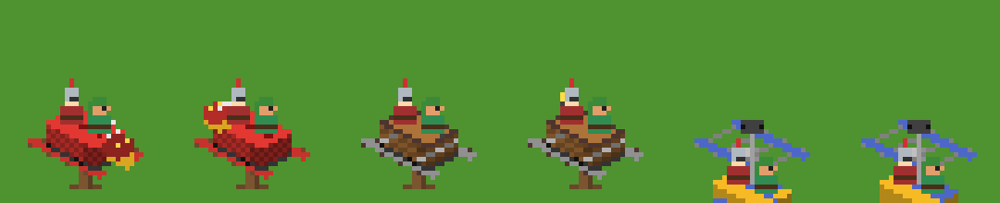<br>
  <em>The Wyrm, the Dwarven Minecart and the Griffin Flyer, each in two headings</em>
</p>

| | |
|---|---|
| 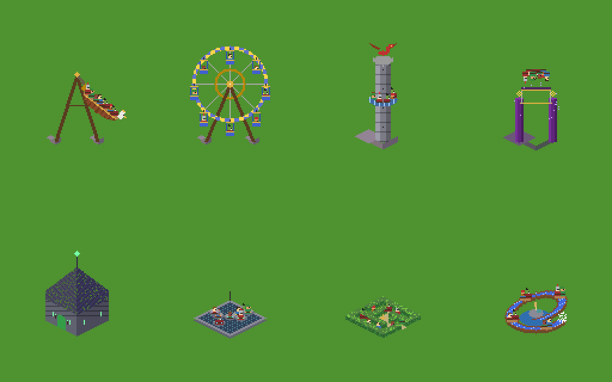 | 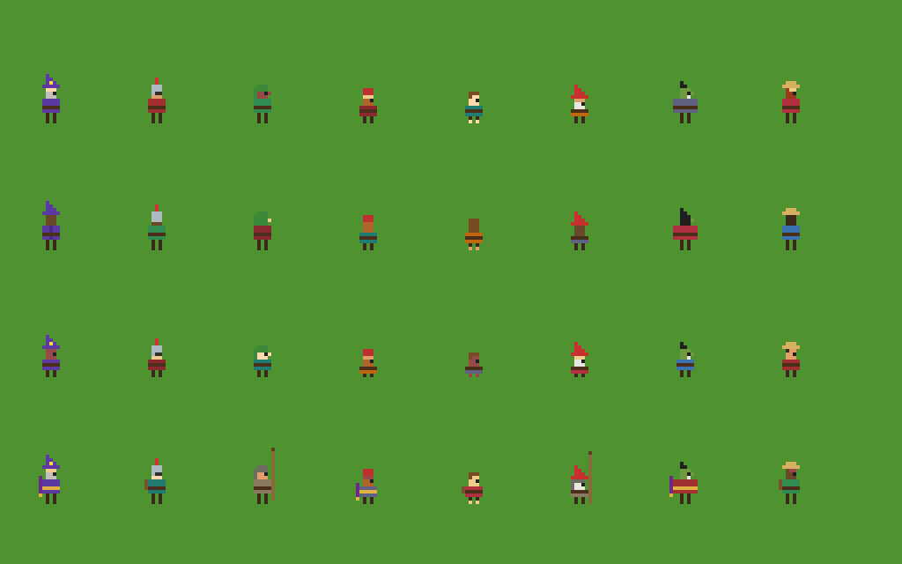 |
| Rides mid-run, every seat taken | The crowd: eight folk, children, outfits |

## What's in it

- **Rides and shops.** Eleven rides (the Dragon Carousel, Arcane Spire, Wheel of Stars, Dragon's Eyrie,
  Griffin Swing, Lich's Crypt, Golem Bumpers, Hedge Labyrinth, Wizard's Whirl, Mermaid Flume and your own
  coasters) and six shops (potions, a tavern, ices, wisps, a healer's tent and privies). Each ride has its own cycle,
  loading waits, ratings, price and wear. Riders are drawn in their seats.
- **Custom roller coasters, as many as you like.**
  - A construction window with grouped piece buttons (straights, turns, banked turns, gentle and steep
    slopes, lift hill, brakes, station), each with a key. The next piece previews as a green or red ghost
    with its price and heights.
  - Three coaster types (the wooden Wyrm, the Dwarven Minecart, the Griffin Flyer, whose cars hang below
    the rails), 1 to 20 cars per train, and a train count and lift speed to choose.
  - RCT-style testing: an empty train laps the track while the ride stays shut to guests. A dry run
    measures top speed, drops, height, G-forces and air time, which set the ratings. A failed test marks
    the piece the train couldn't climb.
  - Cut track from any piece, demolish a coaster, and save finished layouts as designs.
- **Guests with minds of their own.** Needs (hunger, thirst, energy, nausea, happiness, the privy),
  individual taste for thrills, judgement of prices, and thoughts shown in bubbles. They queue single
  file, pay, ride, remember a ride that was too dear, get sick, drop litter and go home. Each has a name,
  such as "Sir Halvard of Wyvern Hill".
- **Staff.** Brownies sweep and empty bins, Dwarven Tinkers repair breakdowns, Watch Knights stop vandals,
  and Bards cheer guests up.
- **A living park.** Days and nights, rain, lanterns and fireflies. Paths climb terraces by stairs, guests
  walk up them, and walkway bridges cross over paths and coaster track.
- **Structure.** Sandbox or three scenarios with goals and deadlines, research, awards, loans, an entry
  fee, and land to buy.
- **Sound and music.** An original organ waltz, coins, bells, the crowd's murmur, the lift hill's clack,
  a different rumble for each coaster type, and screams on fast drops. All synthesized a sample at a time.
- **Comfort.** Zoom levels, a follow cam for coasters, guests and staff, speeds from 1/4 to 3x, window sizes,
  dynamic resolution that only steps in below about 22 fps, and a keys window.

## Why Bend

Bend is a functional language whose runtime runs independent work in parallel automatically, compiles to a
single C file (or to JavaScript), and has a proof checker built in. A park sim is a stress test for all
three: thousands of things to simulate and draw every frame, and plenty of rules that must never break.

**What it gave this project**

- **Parallelism without threads or locks.** The renderer cuts each frame into 64-pixel cells and 16-pixel
  tiles and builds the back and front halves of the map at the same time. Bend spreads that work across
  every core by itself: there is no thread pool, no locking and no data race to debug. That is how a
  CPU-only renderer, where every pixel of every sprite is a function call, holds 60 fps with 700 guests.
- **One pure function for the whole park.** Every change goes through `Park.step` (a tick, a build, a track
  edit, a setting). That makes the game deterministic and easy to test headlessly: screenshots, save round
  trips, scripted UI clicks, scenario runs and coaster test runs are all plain function calls
  (see [For developers](#for-developers)).
- **Proofs about the real game code.** The laws in `LAWS.bend` are types, and `PROOF.bend` proves them
  about the same functions the game runs, not a model of them. `bend PROOF.bend` fails if any law is open
  or false. When a feature changed the rules (more coasters, test runs, trains of up to 20 cars), the
  proofs said exactly which paths through the code had to be accounted for.
- **A small, dependency-light binary.** The whole game compiles to one C file and a 4.7 MB executable that
  needs only libX11 (and `pacat` for sound).
- **Art and sound as code.** A pure language suits procedural assets: a ride, a guest, a coaster car or a
  note is a function of its inputs, so the game ships with no asset pipeline at all.

**What it cost**

- Evaluation is strict, so both branches of a choice are computed unless you dispatch with a `match`.
  Several slowdowns came from exactly this, and the fixes are recorded in the roadmap.
- No mutual recursion or forward references, careful annotations on arithmetic, and no division in a
  per-pixel path. A release build takes about four minutes.
- GPU execution isn't available under WSL2, so everything runs on the CPU. It turned out to be enough.
- The JavaScript target runs the simulation well, but drawing a frame pixel by pixel in JS is roughly 150
  times too slow, so a browser version needs a different route (see the roadmap).

## The laws

`LAWS.bend` states them and `PROOF.bend` proves them. Running `bend PROOF.bend` prints `All terms check.`
only when every one holds.

1. **money_conserved**: after any step, the park's gold is its gold before with that step's ledger applied.
2. **headcount_conserved**: guests after, plus guests who left, equals guests before, plus guests who arrived.
3. **needs_bounded**: every guest's needs (bladder included) stay within 0..255.
4. **coaster_on_circuit**: every open coaster's track closes back on its station.
5. **no_collisions**: a block holds at most one train, and the block signals never lose or duplicate one.
6. **save_load_roundtrip**: loading a save gives back exactly the park that was saved.
7. **capacity_respected**: the boarding plan never seats a guest at or past their ride's seat count.
8. **riders_conserved**: nobody leaves the park from a ride.
9. **board_only_when_loading**: guests board only rides that are loading.
10. **ride_until_unloading**: a rider stays aboard until their ride unloads.
11. **seats_unique**: the boarding plan never gives one seat to two guests.
12. **purchase_is_transfer**: a guest who buys pays exactly the price the park books.
13. **prices_bounded**: ride prices stay within 0..20 gold and the entry fee within 0..40.
14. **litter_accounted**: every piece of litter is on the ground, swept, or in a bin.
15. **wages_booked**: every wage paid goes through the ledger.
16. **open_only_tested**: a coaster carries trains only on its test run or once it has passed one.

Laws 1-4 and 13-16 hold for every possible step (any tick, any build, any track edit), so they hold for
anything a player or the clock can do. Laws 5-12 hold for every possible input to the functions they
describe.

## Build and run

The game runs on **Linux (x86-64, X11)** and on **Windows 11 through WSL2**, whose built-in graphics
(WSLg) show the window and play the sound.

1. Install Bend (Linux, or Ubuntu under WSL):

   ```bash
   curl -fsSL https://bend-lang.com/install.sh | sh
   ```

   Also install a C compiler, the X11 development headers and, for sound, PulseAudio's `pacat`:

   ```bash
   sudo apt install build-essential libx11-dev pulseaudio-utils
   ```

2. Build and play:

   ```bash
   git clone https://github.com/RedLynx101/eldergrove-faire.git
   cd eldergrove-faire
   ./b.sh build main.bend park     # Bend compiles the game to one C file, then a binary (a few minutes)
   ./park                          # play
   ```

3. Optionally, check the laws:

   ```bash
   bend PROOF.bend                 # prints "All terms check."
   ```

On Windows, run the same commands in the Ubuntu (WSL) terminal. To start the game from PowerShell:
`wsl -d Ubuntu -- bash -lc "cd ~/eldergrove-faire && ./park"`.

Saves go to `eldergrove.sav` (F5 saves, F9 loads) and track designs to `designs.sav`, both in the folder
you start the game from.

## Controls

| Key | Action |
|---|---|
| W A S D / arrows | Move the camera (always) |
| Mouse wheel / Page Up, Page Down | Zoom: close, normal, far |
| Click / drag | Use the tool (drag to lay paths, land, bridges) |
| Right-click | Inspect whatever is under the mouse, whatever the tool |
| 1 - 6 | Toolbar tabs: paths and furniture, land, scenery, gentle rides, thrill rides, shops (press again for the next tool) |
| I / X / U | Inspect / demolish / queue line |
| R | Turn the next thing you place |
| P / F / K / O | Park, finances, staff and options windows |
| Space / + / - | Pause and resume / faster / slower (1/4, 1/2, 1x, 2x, 3x) |
| M / N | Music / sound effects on or off |
| F5 / F9 | Save / load |
| Esc | Close the front window (with none open, quit) |

While a coaster's construction window is open: `T` straight, `G`/`H` turn, `Q`/`E` banked turn, `Y`/`B`
gentle up/down, `C`/`V` steep up/down, `L` lift hill, `J` brakes, `Z` station, `Backspace` undo.
**Options → KEYS** lists every control in the game.

## Playing

**Rides need a way in and a way out.** The entrance is a queue line (U) touching the ride, marked by a
green arch. Guests join it only at its free end and walk it single file. The exit is any path beside the
ride, marked by a red arch. A ride without both shows a warning and doesn't run; shops need neither.
Hover over a ride to see its state, and click it to open its window: price, waits, riders, customers,
income, reliability and ratings.

**Guests judge everything.** A ride is worth its excitement to them, a potion is worth more the thirstier
they are, and each guest has their own taste for intensity (children stick to gentle rides). They say
what they think in bubbles, get fed up with long queues, grow queasy on wild rides, and complain about
filthy paths. Click a guest to see their name, thoughts, needs and gold.

**Keep the park running.** Litter piles up without Brownies and bins, rides wear out and break down
without Tinkers, miserable guests smash benches unless a Watch Knight is near, and Bards lift the mood.
The park window shows the rating, guest count, entry fee and research. The finances window breaks down
income and costs, and borrows or repays.

**Building a coaster**, from the thrill rides tab:

1. Click to place a station. Its construction window opens.
2. Hover a piece button to preview it at the end of the track, green if it fits and red if not; click it
   (or press its key) to lay it. The window says how far you are from the station and why a piece can't
   go down.
3. Close the circuit back into the station. The game checks it at once: a circuit that passes starts its
   test run by itself.
4. When the test passes, the ride window shows speed, length, height, drops, G-forces, air time and the
   ratings. Open the ride from there. A failed test puts a red sign over the piece the train couldn't
   climb; add a lift hill or a bigger drop before it.
5. Set the type, trains, cars and lift speed in the construction window. Any change means a new test.
6. The demolish tool on coaster track removes that piece and everything after it. DEMOLISH in the ride
   window (click twice) removes the whole coaster. SAVE AS A DESIGN keeps a finished coaster; the design
   tool in the thrill tab builds it anywhere.

**Follow cam:** FOLLOW in a ride, guest or staff window rides along with a coaster's lead car or trails
a guest or staff member. Any camera key lets go.

## For developers

Every mode below runs headlessly and exercises the real game code:

| Command | What it does |
|---|---|
| `./park --shot out.ppm TICKS [TOOL CAMX CAMY WIN ZOOM]` | Render one frame after TICKS ticks (`python3 tools/ppm2png.py out.ppm out.png` to view) |
| `./park --uitest` | Click through the windows, toolbar, a new coaster and the follow cam; report what changed |
| `./park --savetest TICKS` | Save a busy park, load it back, compare word for word |
| `./park --coastertest` | Test runs that pass and fail, cuts, demolition, designs, long trains, 17 coasters |
| `./park --bridgetest` | Walkway layers: which level a guest steps onto from where |
| `./park --scen K MONTHS` | Play scenario K (0 sandbox, 1-3) a month at a time |
| `./park --bench FRAMES WARMUP [MODE] [CROWD]` | Time frames (mode 0 full, 1 simulation, 2 scene) |
| `./park --live CROWD WARMUP` | Play with CROWD extra guests after WARMUP ticks |
| `./park --people / --rides / --pieces / --cars out.ppm` | Sheets of every guest, ride, track piece and coaster car |
| `./park --wav out.wav SECONDS` | Record the music and every effect (`python3 tools/wavcheck.py` to inspect) |

For `--shot`, WIN is a window to show (kind × 256 + its subject), and a few kinds bring their own scene:
8 is a coaster under construction, 10 the designs, 11 a walkway, 12 a long train. TOOL 99 follows the
starter coaster.

Environment variables: `PARK_OPT=n` (start options), `PARK_PROF=1` (frame timings), `PARK_NOPACE=1`
(no 60 Hz cap), `PARK_DUMP=out.ppm` (write the 300th shown frame), `PARK_MUTE=1` (no sound).
`tools/prof.sh ./park ...` profiles with perf, and `tools/abtest.sh` compares speed against another
commit. Machine speed drifts, so always compare interleaved runs.

`tools/reorder.py FILE` sorts a Bend file's definitions so every name is defined before it's used, which
Bend requires.

## Project layout

| File | What |
|---|---|
| `core.bend` | The simulation: the map (a quadtree), guests, rides, staff, economy, research, coaster track, block signals, test runs. Pure; every change goes through `Park.step`. |
| `main.bend` | The renderer (a parallel quadtree rasterizer), UI and windows, input, picking, the follow cam, track designs, the app loop and the headless modes. |
| `art.bend` | All the art: terrain, water, trees, rides, guests, staff, coaster track and cars, icons, day, night and rain. |
| `sound.bend` | The synthesizer: the waltz, the effects, each coaster's rumble, the mix. |
| `font.bend` | An original 3×5 pixel font. |
| `save.bend` | The save format: an encoder and a stack-machine decoder, proven to round-trip. |
| `LAWS.bend` / `PROOF.bend` | The laws and their proofs. |
| `win_frame.c`, `win_config.js`, `win_frame.js` | The window effect: a parallel blit of the frame and window sizing (C; JS stubs for the JS target). |
| `snd.c`, `snd_open.js`, `snd_write.js` | The sound effect: a sample ring played through `pacat` (JS: a silent stand-in). |
| `b.sh` | Check, build and run helper. |
| `tools/` | Generators for the font, tunes and thought icons; screenshot and WAV converters; profiling, A/B timing, definition reordering. |
| `spike/` | The first performance experiments with Bend's parallelism. |
| `docs/images/` | The screenshots in this README, all rendered by `./park --shot` and the sheet modes. |
| `ROADMAP.md` | The plan, every milestone, every design call, and the measurements behind them. |

## License and credits

Eldergrove Faire is released under the [MIT License](LICENSE). Three small effect files are adapted from
Bend's own window and audio effects and remain under the Apache License 2.0; see
[THIRD_PARTY_NOTICES.md](THIRD_PARTY_NOTICES.md).

All art, music and sound are original and generated by the code. The game takes its inspiration from
RollerCoaster Tycoon 2 but uses none of its assets, and is not affiliated with its owners.

Made by Noah Hicks, built with Claude Code as a coding partner (the commits say which ones). The laws are
the human-owned part: every rule in `LAWS.bend` was chosen by hand, and the code had to prove it kept
them.
